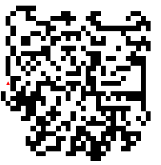
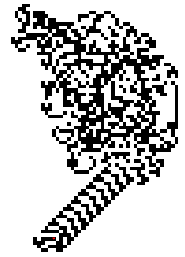
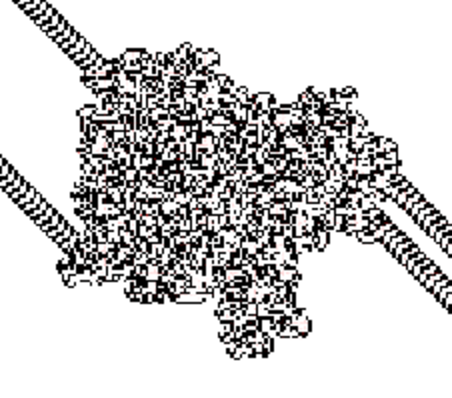
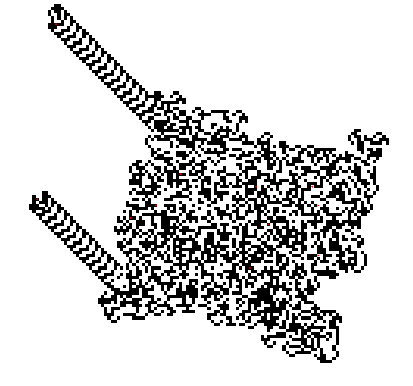

Jason Whitfield

## Complex Systems 530 Assignment 3

The ant appears to walk totally randomly until it enters the cycle. I think that this occurs because there just happens to be a certain pattern of cells that causes a cycle in the ants movement. So, the ant performs a random walk until it just happens to enter that cycle. I suspect that there might be other patterns of cells that cause cycles, but we can’t observe them because the ant will never leave the first cycle.

_Figure 1: Seemingly random walk after approximately 5,000 ticks._

_Figure 2: Ant cycle after approximately 10,000 ticks._

For my extension, I decided to see how multiple ants affect the system. So, every 1,000 ticks, I spawn a new ant at (0, 0). Each ant should take a different walk from the previous ants, as the initial conditions of the cells for each walk are different. So, if other cycles are possible, we might observe them in different ants.

When I ran the simulation, I found that the behavior of each ant is similar to the behavior of the single ant. At approximately 10,000 ticks, two ants enter cycles similar to the cycle of the single ant. Over time, more ants enter cycles of the same shape, but different directions. It seems that the cycles can occur in any direction at the edge of the explored space, but their general shape is always the same. So, it appears that the only cycle likely to occur is the one observed with the single ant. It’s possible that there exists a cycle that is composed of more tiles, but is so unlikely to randomly occur that we never see it. 

_Figure 3: Two ants in cycles after approximately 10,000 ticks._

_Figure 4: Two more ants in cycles after approximately 20,000 ticks._
